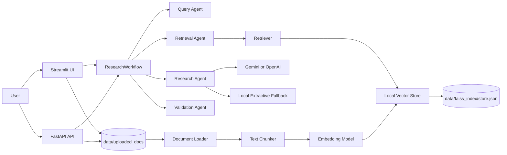
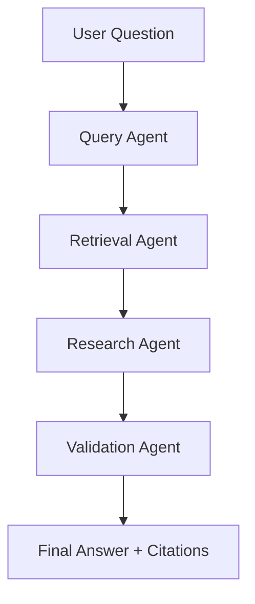
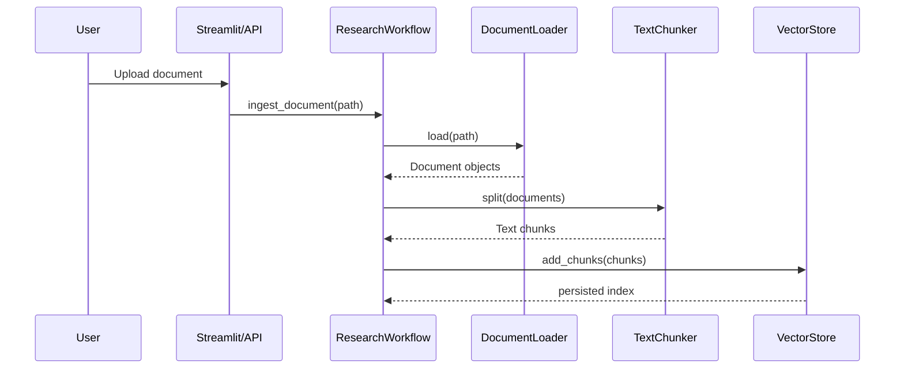
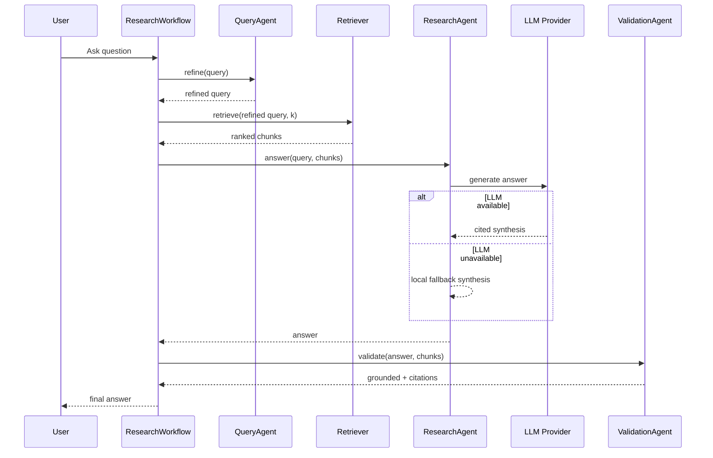

# Architecture

## Overview

The Multi-Agent Research Assistant is a local-first RAG application. Users upload documents, the system chunks and indexes those documents, and research questions are answered by coordinating specialized agents over retrieved evidence.

The project does not use Docker. It runs directly with Python, Streamlit, and FastAPI.

## High-Level Architecture



## Main Components

### Frontend

`frontend/streamlit_app.py`

The Streamlit app is the main user interface. It allows users to:

- upload documents
- automatically index uploaded files
- rebuild the search index from existing uploaded files
- ask research questions
- adjust search depth
- view answer citations

### API

`app/api/routes.py`

The FastAPI app exposes programmatic access to the same workflow:

- `GET /health`
- `POST /ingest`
- `POST /query`
- `POST /reset`

The API validates query length, search depth, and uploaded file names.

### Workflow

`app/workflow/langgraph_flow.py`

`ResearchWorkflow` coordinates the full lifecycle:

1. Refine the query.
2. Retrieve relevant document sections.
3. Generate an answer from retrieved evidence.
4. Validate citations and groundedness.
5. Return answer, citations, warnings, and query metadata.

The file name references LangGraph, but the current implementation is a simple explicit Python orchestration layer. This keeps the app easy to run while preserving a clean place to add a real LangGraph state graph later.

## Agent Design



### Query Agent

`app/agents/query_agent.py`

Normalizes user input and handles small query fixes, such as converting `what is ai agents` to `what are ai agents?`.

### Retrieval Agent

`app/agents/retrieval_agent.py`

Delegates search to the RAG retriever and returns ranked chunks.

### Research Agent

`app/agents/research_agent.py`

Generates the final answer. It first tries the configured LLM provider. If no LLM is available, it uses local fallback logic for:

- definition questions
- analytical questions
- comparison questions
- evidence extraction

The fallback is intentionally citation-first, so the system remains usable during API quota errors.

### Validation Agent

`app/agents/validation_agent.py`

Checks that citations in the answer exist in retrieved chunks and orders cited sources first.

## RAG Pipeline



### Document Loading

`app/rag/document_loader.py`

Supported formats:

- `.txt`
- `.md`
- `.csv`
- `.json`
- `.pdf`

PDF support uses `pypdf`.

### Chunking

`app/rag/text_chunker.py`

Text is split into overlapping chunks. The chunker attempts to end chunks at sentence boundaries to reduce broken answers.

Default behavior:

- chunk size: `900`
- overlap: `150`

### Embeddings

`app/rag/embeddings.py`

The app can use OpenAI embeddings when OpenAI is configured. Otherwise it falls back to deterministic local hash embeddings. Gemini is currently used for final answer generation, while retrieval remains local-first.

### Vector Store

`app/rag/vector_store.py`

The local index is stored as JSON:

```text
data/faiss_index/store.json
```

Despite the folder name, this implementation does not require FAISS. The store keeps:

- chunk id
- text
- metadata
- embedding vector

Search uses a hybrid ranking strategy:

- cosine similarity
- keyword overlap
- query term coverage
- phrase/entity matching
- definition intent scoring
- duplicate chunk removal

For short queries, coverage gating prevents unrelated results. For example, `what is ai agents` should not match sales-agent chunks from marketing books unless the chunk also matches `ai`.

## Question Answering Flow



## LLM Provider Layer

`app/llm/openai_client.py`

This wrapper supports:

- Gemini via `google-genai`
- OpenAI via `openai`
- local fallback when no provider is available

Configuration:

```env
LLM_PROVIDER=gemini
GEMINI_API_KEY=your-key
GEMINI_MODEL=gemini-2.5-flash
```

or:

```env
LLM_PROVIDER=openai
OPENAI_API_KEY=your-key
OPENAI_MODEL=gpt-4o-mini
OPENAI_EMBEDDING_MODEL=text-embedding-3-small
```

## Answer Format

The prompt asks the LLM to produce Markdown:

```markdown
**Answer**
Direct answer with citations.

**Evidence**
- Supporting point with citation.
- Supporting point with citation.

**Limitations**
Only shown when evidence is incomplete or conflicting.
```

The local fallback also uses this style for definitions and analytical answers.

## Data And Runtime Files

```text
data/uploaded_docs/       Uploaded user documents
data/faiss_index/         Local JSON vector index
logs/app.log              Application logs
.env                      Local API keys and runtime config
```

These runtime files should not be committed to version control.

## Logging

`app/utils/logging_config.py` configures application and system-level logs.

System logs include:

- application startup context
- Python and OS version
- current working directory
- selected LLM provider
- whether Gemini/OpenAI keys are configured
- vector store path
- upload directory
- workflow initialization
- ingestion counts
- query lifecycle
- top retrieved source ids
- groundedness and citation count

Secrets are not written to logs. API keys are represented only as boolean `configured` flags.

## Known Limitations

- Gemini is used for answer generation, not embeddings.
- The local hash embedding fallback is lightweight and deterministic, but less accurate than production embedding models.
- `langgraph_flow.py` does not yet build a true LangGraph graph.
- The JSON vector store is good for demos and small projects, but large document collections should move to FAISS, Chroma, or another vector database.
